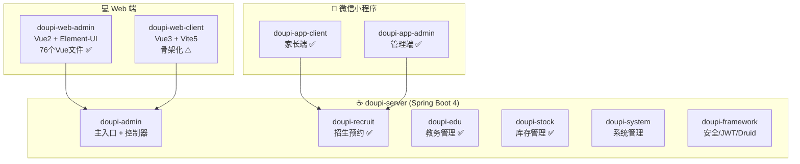
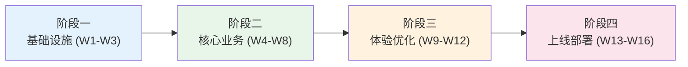

# 豆皮校园管理综合服务平台 — 产品需求文档 (PRD)

> **文档版本**: v2.0  
> **生成日期**: 2026-09-30  
> **项目阶段**: 全面重构与优化  
> **目标用户**: 私立高中（高三 + 高考复读），单一学校专属系统

---

## 一、产品定位与业务背景

### 1.1 产品定位
豆皮系统是一个面向**单一私立高中**的一体化校园管理与招生服务平台。核心解决三大场景：
1. **招生获客与访校预约**：通过微信小程序为家长提供便捷的预约通道，为学校提供完整的招生漏斗管理
2. **教务运营支撑**：文印登记、教师/班级档案管理，以 OCR 智能识别提升效率
3. **校园耗材管控**：物资的入库、出库、盘点与台账报表，实现精细化后勤管理

### 1.2 用户角色矩阵

| 角色 | 使用端 | 核心场景 |
|:--|:--|:--|
| **家长/访客** | 微信小程序（客户端）、Web 用户端 | 浏览校园信息、在线预约访校、查看预约状态与核销码 |
| **招生教师** | 微信小程序（管理端） | 生成个人招生码、推广分享、查看绑定的预约记录 |
| **招生主任/校领导** | 微信小程序（管理端）、Web 管理后台 | 审批绑定、全局预约管理、数据看板分析、现场扫码核销 |
| **教务管理员** | Web 管理后台 | 文印登记与审核、教师/班级档案维护、教务报表 |
| **后勤仓管员** | Web 管理后台 | 物资出入库操作、盘点管理、月度台账报表 |
| **超级管理员** | Web 管理后台 | 系统配置、用户角色权限、监控与运维 |

---

## 二、现状审计与问题诊断

### 2.1 各端现状总览

### 2.2 🔴 严重问题（必须修复）

#### P0-1：微信网关"上帝类"设计缺陷
- **问题**: `DoupiWxDispatcherController` 是一个 500+ 行的巨型类，所有小程序 API（认证、预约、核销、配置、统计等数十个功能）全部塞在一个 `switch-case` 中
- **影响**: 可维护性极差，单点故障风险高，无法独立测试和扩展
- **建议**: 使用策略模式重构，按业务域拆分为独立的 Handler 类

#### P0-2：小程序端 API 无后端鉴权
- **问题**: Spring Security 配置中 `/api/wx/**` 被设为 `permitAll()`，完全绕过 JWT 认证
- **影响**: 任何人只要知道接口地址就可以直接调用后端 API
- **建议**: 为小程序端实现独立的 Token 认证机制（OpenID + 自定义 Token）

#### P0-3：角色判定使用硬编码
- **问题**: `auth.login` 中通过手机尾号（`8888`/`0000`）判定管理员角色
- **影响**: 任何用户伪造手机号即可获取管理权限
- **建议**: 通过后端数据库用户表进行角色关联

### 2.3 🟠 安全隐患（需尽快修复）

#### P0-4：Druid 监控面板弱口令 + 无 IP 白名单
- **问题**: Druid 监控使用弱口令 `doupi/123456`，且 `allow` 为空，外网可直接访问
- **建议**: 生产环境关闭 Druid 监控面板或设置 IP 白名单

#### P0-5：微信网关使用假 Token
- **问题**: 微信端登录后分发 `"wx_tk_" + System.currentTimeMillis()` 的假 Token，无任何签名和过期机制
- **建议**: 改用与 Web 端共享的 `TokenService` 生成真实 JWT

### 2.4 🟡 架构问题（需要改进）

#### P1-1：Web 用户端极度骨架化（但已有 React 骨架）
- **问题**: Vue3 版 `App.vue` 是 960 行单文件；但 `figma_make` 目录下**已有 React + Vite 骨架**（使用 react-router v6），包含师资名录、校园公告等硬编码数据
- **建议**: 在 React 骨架基础上继续开发，对接动态 API

#### P1-2：教务与库存跨模块耦合
- **问题**: `EduOcrServiceImpl` 直接引用了 `StockGoodsMapper`（用于匹配纸张库存）
- **建议**: 通过接口抽象或事件驱动解耦

#### P1-3：Redis 连接池配置过小
- **问题**: `max-active: 8`，高并发预约抢号场景下可能成为瓶颈
- **建议**: 提升至 `max-active: 32`，`max-idle: 16`

#### P1-4：OCR 推理阻塞 Web 主线程
- **问题**: ONNX 模型推理在 Tomcat 主线程池执行，信号量限制 2 并发，单次耗时数十秒
- **建议**: 在 4 核 4G 服务器上必须异步化，推到消息队列或独立进程

#### P1-4：小程序双端大量代码重复
- **问题**: `cloudClient.js`、`request.js`、字典文件等工具代码在两个小程序中完全复制
- **建议**: 抽取为公共 npm 包（`doupi-mp-core`）

### 2.4 🟢 设计亮点（值得保留）

| 亮点 | 说明 |
|:--|:--|
| ✅ 伪云开发代理模式 | 小程序网络层 `cloudClient.js` 完美模拟云函数语义，同时直连自建后端 |
| ✅ 前端 RBAC 权限控制 | 管理端小程序通过 `getAllowedMenuIdsAsync(role)` 实现精细化的角色菜单控制 |
| ✅ 智能缓存策略 | `request.js` 实现了 TTL 缓存 + 写操作自动失效机制 |
| ✅ OCR 智能预填 | 文印登记支持微信截图识别，自动提取教师、班级、文件名、数量等信息 |
| ✅ 出入库事务完整性 | 库存扣减使用乐观锁 + 事务控制，作废操作支持完整回滚 |
| ✅ 数字大屏 | 使用 ECharts + SSE 实时数据推送的全功能招生数据看板 |

---

## 三、功能规划与端归属

### 3.1 功能归属矩阵

> [!IMPORTANT]
> ✅ = 已完成  ⚠️ = 部分完成  ❌ = 未实现  🗑️ = 建议砍掉  📱 = 小程序  💻 = Web

| 功能模块 | 子功能 | Web管理端 | Web用户端 | 小程序家长端 | 小程序管理端 | 现状 | 建议 |
|:--|:--|:--:|:--:|:--:|:--:|:--|:--|
| **招生预约** | 预约看板/数据分析 | 💻 | - | - | 📱 | ✅ | 保留 |
| | 预约列表管理 | 💻 | - | - | 📱 | ✅ | 保留 |
| | 在线预约提交 | - | 💻 | 📱 | - | ✅ | 保留 |
| | 预约详情/核销码 | - | 💻 | 📱 | - | ✅ | 保留 |
| | 现场扫码核销 | 💻 | - | - | 📱 | ✅ | 保留 |
| | 教师绑定审批 | 💻 | - | - | 📱 | ✅ | 保留 |
| | 招生推广二维码 | - | - | - | 📱 | ✅ | 保留 |
| | 教师业绩排行 | 💻 | - | - | 📱 | ⚠️ | 保留 |
| | 校区信息管理 | 💻 | - | - | 📱 | ✅ | 保留 |
| | 排班/时段配置 | 💻 | - | - | 📱 | ✅ | 保留 |
| **教务管理** | 文印登记（含 OCR） | 💻 | - | - | - | ✅ | 保留 |
| | 教师档案管理 | 💻 | - | - | - | ✅ | 保留 |
| | 班级档案管理 | 💻 | - | - | - | ✅ | 保留 |
| | 文印统计报表 | 💻 | - | - | - | ✅ | 保留 |
| | 校园庆典管理 | 💻 | - | - | - | ✅ | **审视必要性** |
| | 教务快捷入口 | - | - | - | 📱 | ❌ | 🗑️ 砍掉 |
| **库存管理** | 物品档案 | 💻 | - | - | - | ✅ | 保留 |
| | 供应商管理 | 💻 | - | - | - | ✅ | 保留 |
| | 采购入库 | 💻 | - | - | - | ✅ | 保留 |
| | 领用出库 | 💻 | - | - | - | ✅ | 保留 |
| | 库存盘点 | 💻 | - | - | - | ✅ | 保留 |
| | 明细查询 | 💻 | - | - | - | ✅ | 保留 |
| | 月度台账报表 | 💻 | - | - | - | ✅ | 保留 |
| | 库存快捷入口 | - | - | - | 📱 | ❌ | 🗑️ 砍掉 |
| **数据大屏** | 招生数据全景大屏 | 💻 | - | - | - | ✅ | 保留 |
| | 庆典活动大屏 | 💻 | - | - | - | ✅ | **审视必要性** |
| **系统管理** | 用户/角色/权限 | 💻 | - | - | - | ✅ | 保留 |
| | 字典/参数配置 | 💻 | - | - | - | ✅ | 保留 |
| | 操作日志/登录日志 | 💻 | - | - | - | ✅ | 保留 |
| | 服务监控 | 💻 | - | - | - | ✅ | 🗑️ 4G 内存不适合 |
| | 代码生成器 | 💻 | - | - | - | ✅ | 🗑️ 开发工具，生产砍掉 |
| | 表单构建器 | 💻 | - | - | - | ✅ | 🗑️ 开发工具，生产砍掉 |
| | 定时任务管理 | 💻 | - | - | - | ✅ | 保留但精简 |

### 3.2 应砍掉的功能（重要决策）

> [!CAUTION]
> 以下功能对于 4 核 4G 轻量服务器来说**不适合保留在生产环境**，或者对单一学校没有实际意义。

| 砍掉功能 | 理由 |
|:--|:--|
| **小程序管理端的教务/库存快捷入口** | 教务和库存是低频操作，仅在 Web 管理端操作即可，移动端做"快捷入口"增加了代码体积和维护成本，且实际使用率极低 |
| **服务器监控页面** | 4G 内存的轻量服务器不需要在后台展示 CPU/内存/JVM 指标，使用云平台自带的监控面板即可 |
| **代码生成器 + 表单构建器** | 纯开发辅助工具，不应暴露在生产环境的管理后台中 |
| **Swagger API 文档页** | 不应在生产环境暴露，通过构建时生成离线文档 |

### 3.3 需要调整方向的功能

| 功能 | 当前问题 | 正确方向 |
|:--|:--|:--|
| **校园庆典管理** | 目前是一个独立的 CRUD 模块，功能过于简单（仅标题+描述），且有独立的庆典大屏 | 评估是否合并到"校园新闻/公告"中，或升级为完整的活动管理（含报名/签到） |
| **Web 用户端** | 960 行的单文件应用，和小程序家长端功能 100% 重叠 | 定位应差异化——**官网展示 + SEO 落地页 + PC 端预约**（面向不用微信的家长或搜索引擎流量），不应和小程序做一样的功能 |
| **Druid 监控面板** | 通过 iframe 直接暴露在管理后台 | 生产环境应禁用或限制 IP 白名单访问 |

---

## 四、产品路线图（3-4 个月）

| 阶段 | 时间 | 关键交付物 |
|:--|:--|:--|
| **阶段一：基础设施** | 第 1-3 周 | React 项目脚手架、Ant Design Pro 基座搭建、登录/权限/路由体系、后端安全加固 |
| **阶段二：核心业务** | 第 4-8 周 | 招生管理页面 React 重写、教务管理页面重写、库存管理页面重写 |
| **阶段三：体验优化** | 第 9-12 周 | 数据大屏 React 重写、Web 用户端从零开发、小程序安全加固与优化、UI/UX 统一 |
| **阶段四：上线部署** | 第 13-16 周 | 全端联调测试、性能调优、4 核 4G 服务器部署方案落地、灰度发布 |

---

## 五、技术约束与边界

| 约束项 | 约束条件 |
|:--|:--|
| 服务器配置 | 4 核 4G 内存，SSD 40-60GB，带宽 3-5 Mbps |
| 前端技术栈 | Web 双端统一迁移到 **React 19 + TypeScript + Ant Design 6** |
| 后端技术栈 | **保持不变** — Spring Boot 4 + JDK 17 + MyBatis + Redis + MySQL 8 |
| 小程序端 | **保持原生** — 微信原生小程序 + TDesign，不做技术栈变更 |
| 数据库 | MySQL 8.0 + Redis 7.0，Docker 容器化部署 |
| 域名 | 需要备案的独立域名 + SSL 证书（小程序要求 HTTPS） |
