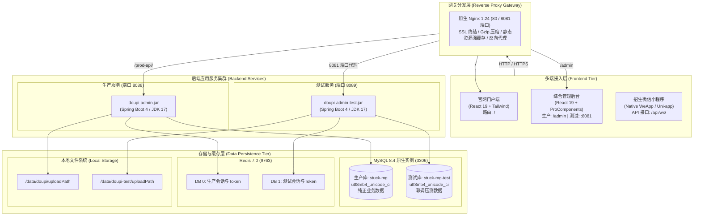

# 01 - 系统架构与业务全景

## 1. 系统总体定位
**汉外华襄复读学校综合管理平台**是专为高三复读与冲刺教育机构打造的全链路数字化支撑体系。涵盖学校品牌门户宣传、在线招生预约、教务班级与排课档案、名师风采动态管理、文印试卷胶印流程全跟踪、以及教务耗材与物资进销存一体化管理。

---

## 2. 平台总体架构设计

---

## 3. 核心业务领域模型

平台围绕学校实际运营，划分为五大核心业务域：

### 3.1 门户宣传与 CMS 动态域 (`doupi_cms_*`)
- **官网栏目矩阵**：首页、关于华襄、高三学年、名师天团、校园生活、招生录取、高考资讯。
- **动态名师风采**：后台维护的名师信息（姓名、科目、简介、教龄、标签、头像）通过 `/api/public/v1/cms/teachers` 实时穿透至官网。
- **弹性降级保障**：官网内置健壮的本地基准兜底策略，网络异常或接口抖动时页面平滑降级，绝不白屏。

### 3.2 招生咨询与访校预约域 (`doupi_recruit_*`)
- **多端触达**：官网访校弹窗、微信小程序预约入口。
- **信息流转**：家长/学生在线填写意向年级、联系电话、预约时间，后台招生办实时接收提醒，跟踪访校回访记录。

### 3.3 教务档案与教师管理域 (`edu_class`, `edu_teacher`)
- **班级体系**：8 个文理精品复读班级全生命周期档案（班主任关联、学生规模、教室位置）。
- **教师档案**：全校 32 位骨干教师档案、科目排课对应关系，与系统用户账号（`sys_user`）实现 1:1 权限绑定。

### 3.4 文印制卷与排版业务域 (`edu_print_record`)
- **试卷胶印流程**：教师发起文印申请 -> 教务处审核 -> 文印室制版印刷 -> 胶装打包 -> 领用确认。
- **耗材核算**：与库存物资自动联动，精准统计各学科、各阶段的用纸与油墨消耗。

### 3.5 物资进销存与领料管理域 (`edu_goods`, `edu_stock_*`, `edu_material_*`)
- **物品档案**：教务耗材、办公用品、学生套装（`edu_goods_kit`）。
- **流程闭环**：期初入库 -> 采购入库 -> 教师领料申请 -> 出库交接 -> 周期性盘点平账。
