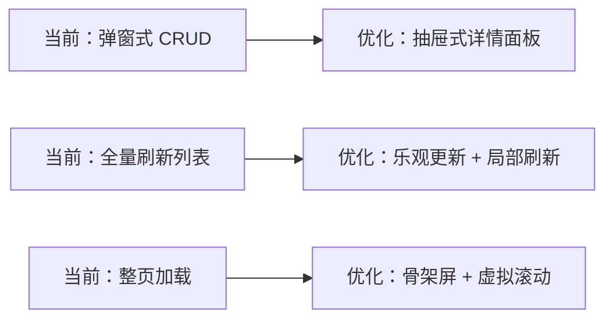

# 豆皮校园管理平台 — UI/UX/UE 优化与设计文档

> **文档版本**: v2.0  
> **生成日期**: 2026-09-30  
> **适用范围**: 全部 5 个端（后端 API 响应规范 + Web 管理端 + Web 用户端 + 小程序家长端 + 小程序管理端）

---

## 一、现有设计体系评估

### 1.1 各端设计语言现状

| 端 | UI 框架 | 主色调 | 圆角风格 | 设计成熟度 | 评价 |
|:--|:--|:--|:--|:--|:--|
| Web 管理端 | Element-UI 2.x | `#3088F4` 蓝 | 4px | ⭐⭐⭐ | RuoYi 标准 CRUD + 定制大屏，视觉统一但略显老旧 |
| Web 用户端（Vue3） | 无 UI 框架 | `#3088F4` 蓝 | 手写 CSS | ⭐⭐ | 960 行单文件，原生 CSS，无设计系统 |
| Web 用户端（React 骨架） | 无 | 待定 | 待定 | ⭐ | 仅静态页面 + 硬编码数据 |
| 小程序家长端 | TDesign Mini | `#3088F4` 蓝 | 16px 大圆角 | ⭐⭐⭐⭐ | 设计最成熟，原子化 CSS + 主题 Token |
| 小程序管理端 | TDesign Mini | `#3088F4` 蓝 | 16px 大圆角 | ⭐⭐⭐⭐ | 与家长端一致的设计语言 |

### 1.2 核心设计问题

> [!WARNING]
> **跨端视觉割裂**：Web 管理端使用 Element-UI 的蓝灰配色体系，而小程序端使用了更加现代的圆角卡片 + 柔和投影风格。两端在同一品牌下视觉差异明显。

| 问题 | 影响端 | 严重性 |
|:--|:--|:--|
| Web 管理端与小程序端设计语言不统一 | 全局 | 🟡 中 |
| Web 用户端无设计系统，手写 CSS 难以维护 | Web 用户端 | 🔴 高 |
| Element-UI 2.x 组件已停止活跃更新 | Web 管理端 | 🟡 中 |
| 数据大屏 3000 行代码含大量内联样式 | Web 管理端 | 🟡 中 |
| 登录页缺少品牌识别度（RuoYi 默认样式） | Web 管理端 | 🟡 中 |

### 1.3 设计亮点（保留并推广）

| 亮点 | 所在端 | 建议 |
|:--|:--|:--|
| 原子化 CSS 工具类（`flex-between`, `p-md`, `text-primary`） | 小程序双端 | 推广到 Web 端（或用 Tailwind 替代） |
| 自定义 TabBar 动效与角色动态渲染 | 小程序家长端 | 保留 |
| 核销成功的大字体反馈卡片 | Web 管理端 | 保留并增强动效 |
| 数据大屏的科技感配色与钻取交互 | Web 管理端 | 迁移到 React 时保留视觉风格 |

---

## 二、统一设计规范（Design Token 体系）

### 2.1 品牌色彩体系

```
┌─────────────────────────────────────────────────────┐
│  品牌主色 (Primary)                                  │
│  ┌──────────┐  ┌──────────┐  ┌──────────┐           │
│  │ #3088F4  │  │ #5CA4F7  │  │ #E8F1FE  │           │
│  │ 主色     │  │ 悬停态   │  │ 浅底色   │           │
│  └──────────┘  └──────────┘  └──────────┘           │
│                                                      │
│  功能色 (Semantic)                                    │
│  ┌──────────┐  ┌──────────┐  ┌──────────┐  ┌──────┐ │
│  │ #2DC84D  │  │ #FF6B35  │  │ #F53F3F  │  │ #999 │ │
│  │ 成功/核销│  │ 警告/预警│  │ 错误/危险│  │ 禁用 │ │
│  └──────────┘  └──────────┘  └──────────┘  └──────┘ │
│                                                      │
│  中性色 (Neutral)                                    │
│  #1D2129 标题  #4E5969 正文  #86909C 辅助  #F2F3F5 背景│
└─────────────────────────────────────────────────────┘
```

### 2.2 字体规范

| 用途 | 字号 | 字重 | 行高 | 适用端 |
|:--|:--|:--|:--|:--|
| 大标题 H1 | 24px / 48rpx | Bold (700) | 1.4 | 全端 |
| 二级标题 H2 | 20px / 40rpx | Semibold (600) | 1.4 | 全端 |
| 三级标题 H3 | 16px / 32rpx | Medium (500) | 1.5 | 全端 |
| 正文 Body | 14px / 28rpx | Regular (400) | 1.6 | 全端 |
| 辅助文字 Caption | 12px / 24rpx | Regular (400) | 1.5 | 全端 |
| 数据大屏数字 | 36-48px | DIN Alternate Bold | 1.2 | Web 大屏 |

### 2.3 间距与圆角

| Token | 值 | 用途 |
|:--|:--|:--|
| `--space-xs` | 4px / 8rpx | 紧凑元素内间距 |
| `--space-sm` | 8px / 16rpx | 表单元素间距 |
| `--space-md` | 16px / 32rpx | 卡片内边距 |
| `--space-lg` | 24px / 48rpx | 区块间距 |
| `--space-xl` | 32px / 64rpx | 页面边距 |
| `--radius-sm` | 4px / 8rpx | 按钮、输入框 |
| `--radius-md` | 8px / 16rpx | 卡片、弹窗 |
| `--radius-lg` | 16px / 32rpx | 大卡片（小程序风格） |
| `--shadow-card` | `0 2px 12px rgba(0,0,0,0.06)` | 卡片投影 |

---

## 三、各端 UI/UX 优化方案

### 3.1 Web 管理端（Vue2 → React + Ant Design 5）

#### 3.1.1 整体方向
- **UI 框架**：从 Element-UI 迁移到 **Ant Design 6**（ConfigProvider 全局主题 Token 注入）
- **布局**：采用 Ant Design Pro Layout（侧边栏 + 顶部导航 + 面包屑 + 标签页）
- **样式方案**：CSS-in-JS (Ant Design 内置) + Tailwind CSS 作为辅助原子类

#### 3.1.2 页面级优化

| 页面 | 现有问题 | 优化方向 |
|:--|:--|:--|
| **登录页** | RuoYi 默认样式，无品牌感 | 左侧学校宣传图 + 右侧登录表单，增加 Logo 和品牌 Slogan |
| **首页仪表盘** | 空白首页 | 角色自适应仪表盘：管理员看运营数据，教务看待办任务 |
| **招生看板** | 自定义卡片 + 渐变色 | 使用 Ant Design Statistic + 卡片组件，保留渐变视觉 |
| **文印登记** | 2000+ 行 Vue 复杂表单 | 拆分为步骤表单（Step Form）：① 上传截图/粘贴文字 → ② OCR 结果确认 → ③ 提交登记 |
| **库存出入库** | 弹窗内主子表 | 改用抽屉（Drawer）替代弹窗，给明细表格更多空间 |
| **数据大屏** | 3000 行单文件 | 拆分为独立路由页面，使用 React + ECharts 组件化重构 |

#### 3.1.3 交互优化



### 3.2 Web 用户端（从零构建 React 品牌官网）

#### 3.2.1 定位差异化

> [!IMPORTANT]
> Web 用户端**不应**与小程序家长端做一样的功能。它的定位是：
> - 🌐 **学校品牌官网**（SEO 友好，搜索引擎可索引）
> - 📋 **PC 端预约入口**（面向不使用微信的家长或使用电脑的家长）
> - 📊 **信息展示大厅**（校园风貌、师资团队、招生简章等重内容页面）

#### 3.2.2 页面规划

| 页面 | 内容 | 设计要点 |
|:--|:--|:--|
| 首页 | Hero Banner + 学校亮点 + 快速预约入口 | 全屏大图，品牌色渐变，CTA 按钮突出 |
| 学校概况 | 办学理念、校史、荣誉 | 长滚动页面，图文交替排版 |
| 师资团队 | 教师照片 + 简介卡片网格 | 卡片 Hover 动效，响应式网格 |
| 校园风貌 | 图片/视频画廊 | 瀑布流或 Swiper 轮播 |
| 在线预约 | 预约表单（PC 适配版） | 步骤式表单，与小程序预约接口复用 |
| 预约查询 | 手机号 + 核销码查询 | 简洁卡片展示预约状态 |

#### 3.2.3 技术选型
- **框架**：React 18 + TypeScript + Vite
- **UI**：Ant Design 5（与管理端统一）或更轻量的 Tailwind CSS + Headless UI
- **SEO**：考虑使用 Next.js SSR/SSG 提升搜索引擎收录（可选，视服务器压力）

### 3.3 小程序双端（TDesign 优化）

#### 3.3.1 家长端优化

| 页面 | 优化点 |
|:--|:--|
| 首页 | 轮播图增加视频支持，快速入口增加「在线咨询」 |
| 预约表单 | 增加预约时段的可视化日历选择器（替代下拉选择） |
| 预约详情 | 核销码增大显示，增加倒计时提醒 |
| 个人中心 | 增加预约统计卡片（已预约/已完成/已取消） |

#### 3.3.2 管理端优化

| 页面 | 优化点 |
|:--|:--|
| 工作台 | 待办事项按紧急程度排序，增加红点提醒 |
| 核销页 | 扫码成功增加振动反馈 + 声音提示 |
| 数据看板 | 简化图表，仅展示核心 KPI（今日预约/本周转化率） |

---

## 四、数据大屏设计专项

### 4.1 现状评估
- 当前大屏 `screen/index.vue` 是 **3000 行**的巨型单文件
- 使用 ECharts 渲染 6+ 个图表区域
- 支持 SSE 实时数据推送
- 自适应 1920×1080 分辨率
- 支持全屏模式和深度钻取弹窗

### 4.2 React 重构方案

```
大屏布局 (Grid)
┌──────────────────────────────────────────────┐
│  Header: 学校名称 + 当前时间 + 天气          │
├──────────┬────────────────────┬──────────────┤
│ 左侧面板  │   中央主视觉区     │  右侧面板    │
│ - 今日数据 │   - 地图/校区分布  │  - 趋势图    │
│ - 预约统计 │   - 核心 KPI 数字  │  - 排行榜    │
│ - 转化漏斗 │                   │  - 活动流水  │
├──────────┴────────────────────┴──────────────┤
│  Bottom: 滚动消息条 / 最近预约实时流         │
└──────────────────────────────────────────────┘
```

- **组件化拆分**：每个面板独立为 React 组件，通过 Context 共享 SSE 数据源
- **ECharts 封装**：使用 `echarts-for-react` 或自封装 `useECharts` Hook
- **自适应方案**：使用 CSS `scale` 变换 + `rem` 基准值，适配不同分辨率

---

## 五、响应式与无障碍设计

### 5.1 断点规范

| 断点 | 尺寸 | 适用场景 |
|:--|:--|:--|
| `xs` | < 576px | 手机竖屏 |
| `sm` | ≥ 576px | 手机横屏 |
| `md` | ≥ 768px | 平板 |
| `lg` | ≥ 992px | 小笔记本 |
| `xl` | ≥ 1200px | 桌面显示器 |
| `xxl` | ≥ 1600px | 大屏/数据大屏 |

### 5.2 无障碍 (A11Y) 基础要求
- 所有交互元素具备 `aria-label`
- 色彩对比度符合 WCAG 2.1 AA 标准（4.5:1）
- 支持键盘 Tab 导航
- 表单错误信息关联到对应输入框
