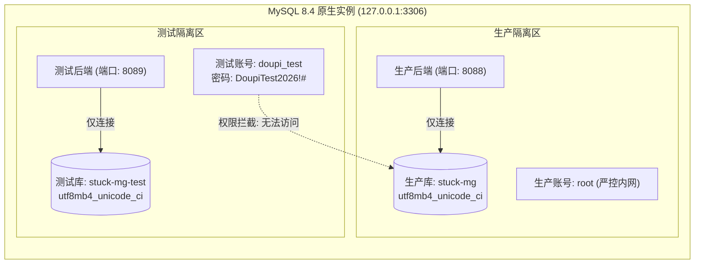

# 02 - 数据库设计与环境隔离规范

## 1. 双环境物理隔离设计

为确保生产环境数据的高可用与绝对安全，杜绝开发测试过程中的误删与数据污染，系统实行**严格的物理库级隔离**。



### 1.1 核心隔离技术指标
- **权限边界**：测试账号 `doupi_test` 仅被授予 `stuck-mg-test` 库的 DDL/DML 权限，物理上无法执行任何跨库（`stuck-mg`）操作。
- **缓存隔离**：生产使用 Redis Database `0`，测试使用 Redis Database `1`，键空间绝对隔离。
- **上传物理隔离**：生产文件保存在 `/data/doupi/uploadPath/`，测试文件保存在 `/data/doupi-test/uploadPath/`。

---

## 2. 数据库字符集与排序规则统一规范

### 2.1 规范要求
- **默认字符集**：`utf8mb4`
- **默认排序规则 (Collation)**：**`utf8mb4_unicode_ci`**
- **严禁混用**：禁止使用 MySQL 8 默认的 `utf8mb4_0900_ai_ci`。若排序规则不一致，在执行多表 `JOIN` 或字符字段等值匹配（`=`）时将抛出 MySQL 1267 致命错误：
  ```
  Illegal mix of collations (utf8mb4_0900_ai_ci,IMPLICIT) and (utf8mb4_unicode_ci,IMPLICIT) for operation '='
  ```

### 2.2 统一校验与修复脚本
全库 54 张表已全部完成统一转换，标准维护脚本参见 [`scripts/convert_collation.sql`](../scripts/convert_collation.sql)。新建表时务必显式声明：
```sql
CREATE TABLE `edu_example` (
  `id` bigint NOT NULL AUTO_INCREMENT,
  `name` varchar(64) COLLATE utf8mb4_unicode_ci DEFAULT NULL,
  PRIMARY KEY (`id`)
) ENGINE=InnoDB DEFAULT CHARSET=utf8mb4 COLLATE=utf8mb4_unicode_ci;
```

---

## 3. 数据表结构分类字典 (共 54 张核心表)

| 模块分类 | 表名前缀 / 表名 | 数量 | 职责说明 |
| :--- | :--- | :--- | :--- |
| **教务核心** | `edu_class` | 1 | 班级基础档案（班级名称、年级、班主任） |
| | `edu_teacher` | 1 | 教师骨干档案（科目、职称、教龄、头像） |
| | `edu_celebration` | 1 | 校园荣誉、高考捷报喜报 |
| **物资与文印** | `edu_goods`, `edu_goods_kit*` | 3 | 物品档案、物资套装包与明细 |
| | `edu_stock_in*`, `edu_stock_out*` | 4 | 入库单、出库单及其明细表 |
| | `edu_stock_check*` | 2 | 周期盘点单与盘点盈亏明细 |
| | `edu_material_record*` | 2 | 教师教具领料记录及明细 |
| | `edu_print_record` | 1 | 试卷文印申请、制版与用纸跟踪流水 |
| | `edu_supplier` | 1 | 耗材供应商名录 |
| **门户与CMS** | `doupi_cms_*` (8张) | 8 | 官网文章、Banner、栏目、设施、名师展示 |
| **招生预约** | `doupi_recruit_*` (5张) | 5 | 访校预约单、校区配置、线索留言 |
| **若依系统底座** | `sys_*` (18张) | 18 | 用户、角色、菜单、部门、岗位、字典、日志 |
| **Quartz任务** | `QRTZ_*` (11张) | 11 | 系统定时任务调度引擎数据表 |

---

## 4. 生产数据重置与脱敏同步策略

- **生产数据重置标准**：执行 [`scripts/clean_production_data.sql`](../scripts/clean_production_data.sql)，仅保留系统字典、8个班级、32位教师档案、物品分类及管理员账号，清空所有流水单据并将库存重置为 0。
- **测试库重新同步**：若需要刷新测试库，通过管理员在服务器执行一键全量覆盖：
  ```bash
  mysqldump -u root -p123456 --single-transaction stuck-mg | mysql -u root -p123456 stuck-mg-test
  ```
