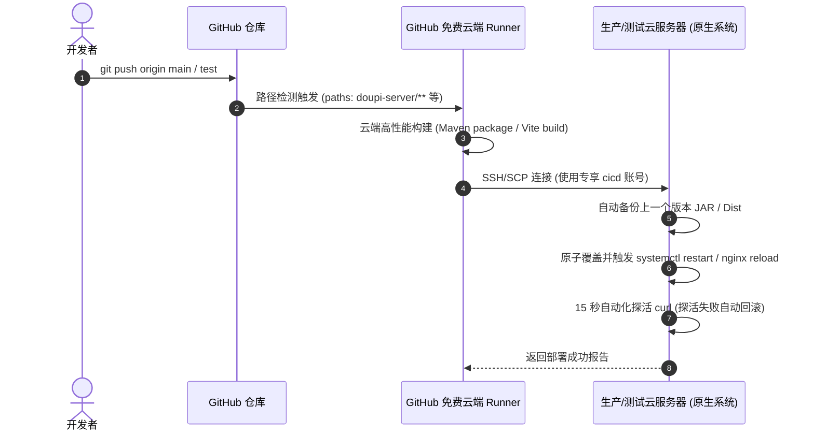

# 03 - 原生部署与 CI/CD 自动化手册

## 1. 原生部署设计原则（拒绝 Docker，坚持原生高效）

本项目在生产及测试环境中**完全摒弃 Docker 容器化技术**，采用 Linux 原生技术栈（Systemd + Nginx + 原生二进制）。

### 1.1 原生架构优势
1. **极致节省内存**：当前云服务器为 4GB 内存。若运行 Docker 守护进程及多个容器桥接网络，额外开销极大；采用原生部署，两套完整后端（生产 8088 + 测试 8089）共仅占用 ~1.5GB 物理内存，稳定富余。
2. **零抽象层损耗**：磁盘 I/O 与网络套接字直通 Linux 内核，吞吐量相比 Docker 桥接模式大幅提升。
3. **运维透明可控**：原生 `systemctl`、标准日志轮转、直接使用 `ps` / `top` / `journalctl` 监控，排障直观。

---

## 2. 后端服务 Systemd 原生托管

### 2.1 服务单元配置
- **生产服务**：`/etc/systemd/system/doupi-server.service`（端口 `8088`，运行目录 `/data/doupi`）
- **测试服务**：`/etc/systemd/system/doupi-server-test.service`（端口 `8089`，运行目录 `/data/doupi-test`）

### 2.2 守护进程常用维护命令
```bash
# 查看服务运行状态
sudo systemctl status doupi-server.service
sudo systemctl status doupi-server-test.service

# 重启服务 (支持优雅平滑重启)
sudo systemctl restart doupi-server.service
sudo systemctl restart doupi-server-test.service

# 查看实时控制台滚动日志
tail -f /data/doupi/logs/console.log
tail -f /data/doupi-test/logs/console.log
```

---

## 3. Nginx 双环境网关配置

Nginx 原生接管宿主机网络分发，统一配置文件位于 `/etc/nginx/sites-available/doupi.conf`。

### 3.1 生产环境虚拟主机 (监听 80 端口)
- **根路径 `/`** -> 托管门户官网前端 `/var/www/doupi-web-client/dist`
- **后台路径 `/admin`** -> 托管管理后台前端 `/var/www/doupi-web-admin/dist`
- **业务 API `/prod-api/`** -> 反向代理至 `127.0.0.1:8088/`
- **公共接口 `/api/`** -> 反向代理至 `127.0.0.1:8088/api/`
- **附件媒体 `/profile/`** -> 映射至 `/data/doupi/uploadPath/`

### 3.2 测试环境虚拟主机 (监听 8081 端口)
- **管理后台 `/`** -> 托管测试端后台前端 `/var/www/doupi-web-admin-test/dist`
- **业务 API `/prod-api/`** -> 反向代理至 `127.0.0.1:8089/`
- **测试附件 `/profile/`** -> 映射至 `/data/doupi-test/uploadPath/`

```bash
# 检测配置语法并平滑热重载
sudo nginx -t && sudo systemctl reload nginx
```

---

## 4. GitHub Actions CI/CD 纯原生自动化流水线

### 4.1 流水线执行架构


### 4.2 CI/CD 专属部署账号与最小权限安全矩阵
为了杜绝泄露主账号 `ubuntu` 的超级控制权，服务器设立了专用部署用户 **`cicd`**：
1. **密钥登录**：生成了独立专用的 ED25519 密钥对，公钥配置在 `/home/cicd/.ssh/authorized_keys`。
2. **目录 ACL**：仅对 `/data/doupi`、`/data/doupi-test`、`/var/www` 赋予普通读写权限，无权访问其他系统敏感文件。
3. **Sudo 最小提权 (`/etc/sudoers.d/cicd`)**：仅允许免密执行 `systemctl restart doupi-server*` 与 `nginx reload`，严禁执行任意高危操作。

### 4.3 自动化探活与自动回滚机制
在 `deploy-server.yml` 中内置了严密的自动化健康检测：
- 重启后循环轮询 15 秒探测 `/login` 接口响应。
- 若探活通过，完成发布；
- 若探活超时（如代码有未捕获异常导致无法启动），流水线会自动从 `/data/doupi/backups/` 恢复上一版本的 JAR 包，并重新重启恢复服务，同时在 GitHub Actions 中高亮报警。
