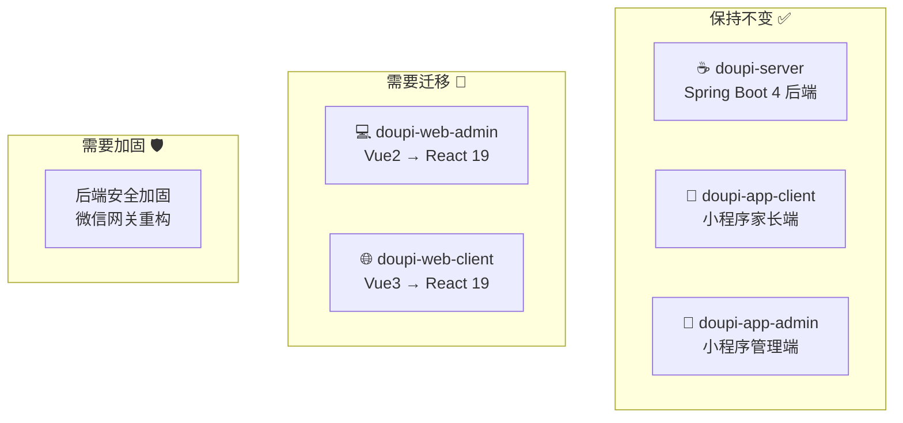
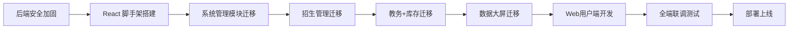

# 豆皮校园管理平台 — 迁移与开发计划

> **文档版本**: v2.0  
> **生成日期**: 2026-09-30  
> **总工期**: 16 周（4 个月）  
> **团队配置假设**: 1-2 人全栈开发

---

## 一、迁移总览

### 1.1 迁移范围



### 1.2 关键路径依赖



> [!IMPORTANT]
> **后端安全加固必须先行**。微信网关无鉴权问题（P0）不解决，前端迁移毫无意义。

---

## 二、Vue → React 迁移评估

### 2.1 页面级工作量矩阵

#### Web 管理端 (`doupi-web-admin`) — 76 个 Vue 文件

| 难度 | 页面数 | 代表页面 | 迁移策略 | 预估工时/页 |
|:--|:--|:--|:--|:--|
| 🟢 低 | 42 | system/*, monitor/*, tool/gen/* | Ant Design ProTable 模板生成 | 0.5-1 天 |
| 🟡 中 | 20 | recruit/*, stock/*, edu/class, edu/teacher | 手动重写，保留业务逻辑 | 1-2 天 |
| 🔴 高 | 8 | edu/record (2000行), screen/index (3000行), dashboard/*, login | 完全重构，组件化拆分 | 3-5 天 |
| ⚫ 砍掉 | 6 | tool/build/*, tool/swagger, monitor/server, monitor/druid | 不迁移 | 0 天 |

**总工时估算**: 42×0.75 + 20×1.5 + 8×4 = **~94 人天（约 19 个工作周）**

#### Web 用户端 (`doupi-web-client`) — 全新开发

| 页面 | 复杂度 | 预估工时 |
|:--|:--|:--|
| 首页（Hero + 亮点展示） | 🟡 中 | 2-3 天 |
| 学校概况 | 🟢 低 | 1 天 |
| 师资团队 | 🟢 低 | 1 天 |
| 校园风貌画廊 | 🟡 中 | 2 天 |
| 在线预约表单 | 🟡 中 | 2-3 天 |
| 预约查询 | 🟢 低 | 1 天 |
| 公共组件（Header/Footer/导航） | 🟡 中 | 2 天 |

**总工时估算**: ~**12-15 人天（约 3 个工作周）**

### 2.2 技术栈对应关系

| Vue 2 生态 | → | React 19 替代方案 |
|:--|:--|:--|
| Vue 2.6 | → | React 19 + TypeScript |
| Vue Router 3 | → | React Router 6 |
| Vuex 3 | → | Zustand 或 Redux Toolkit |
| Element-UI 2 | → | Ant Design 6 |
| ECharts (直接引用) | → | echarts-for-react / useECharts Hook |
| vue-count-to | → | react-countup |
| vue-cropper | → | react-image-crop |
| screenfull | → | screenfull (通用库，直接复用) |
| js-cookie | → | js-cookie (通用库，直接复用) |
| axios | → | axios (通用库，直接复用) |

---

## 三、分阶段执行计划

### 阶段一：基础设施与安全加固（第 1-3 周）

| 周 | 任务 | 交付物 |
|:--|:--|:--|
| **W1** | 🛡️ 后端安全加固：重构微信网关鉴权，为小程序实现 OpenID + JWT Token 认证 | SecurityConfig 改造、WxAuthFilter |
| **W1** | 🛡️ 消除硬编码角色判定，改为数据库查询 | auth.login 重写 |
| **W2** | ⚛️ React 脚手架搭建：Vite + React 19 + TS + Ant Design 6 + React Router 6 | `doupi-web-admin-react/` 工程 |
| **W2** | ⚛️ 登录/注销/路由守卫/动态菜单/权限指令 | 基础框架运行 |
| **W3** | ⚛️ 通用组件库：ProTable 封装、字典组件、文件上传、分页器 | 可复用的 CRUD 模板 |
| **W3** | 🛡️ Druid 监控面板安全加固（IP 白名单 / 关闭外网访问） | 配置调整 |

### 阶段二：核心业务迁移（第 4-8 周）

| 周 | 任务 | 交付物 |
|:--|:--|:--|
| **W4** | ⚛️ 系统管理模块批量迁移（用户/角色/菜单/部门/字典/岗位/配置/通知） | 12 个 CRUD 页面 |
| **W5** | ⚛️ 监控模块迁移（在线用户/操作日志/登录日志/缓存管理） | 6 个页面（砍掉 server/druid/表单构建/代码生成/Swagger） |
| **W6** | ⚛️ 招生管理迁移（看板/预约列表/核销/绑定/校区/配置） | 6 个业务页面 |
| **W7** | ⚛️ 教务管理迁移（文印登记重构为步骤表单 + OCR/教师/班级/庆典/报表） | 5 个页面（文印最复杂） |
| **W8** | ⚛️ 库存管理迁移（物品/供应商/入库/出库/明细/盘点/月报） | 9 个页面 |

### 阶段三：体验优化与用户端（第 9-12 周）

| 周 | 任务 | 交付物 |
|:--|:--|:--|
| **W9** | ⚛️ 数据大屏 React 重构（拆分组件、SSE 接入、ECharts 封装） | 独立大屏页面 |
| **W10** | ⚛️ 首页仪表盘开发 + 锁屏功能迁移 | 角色自适应仪表盘 |
| **W11** | 🌐 Web 用户端开发（首页/学校概况/师资/校园风貌） | 品牌官网上线 |
| **W12** | 🌐 Web 用户端开发（在线预约/预约查询） + 小程序优化 | 预约功能闭环 |

### 阶段四：联调测试与上线（第 13-16 周）

| 周 | 任务 | 交付物 |
|:--|:--|:--|
| **W13** | 🧪 全端联调测试（Web 管理端 ↔ 后端 ↔ 小程序） | 测试报告 |
| **W14** | 🧪 性能测试 + 4 核 4G 服务器压测 + JVM 调优 | 性能报告 |
| **W15** | 📦 Docker 部署脚本 + Nginx 配置 + SSL 证书 + 域名绑定 | 部署就绪 |
| **W16** | 🚀 灰度发布 + 数据迁移（云数据库 JSON → MySQL）+ 正式上线 | 正式上线 |

---

## 四、后端重构计划（与前端并行）

### 4.1 安全加固（W1，最高优先级）

| 改造项 | 当前状态 | 目标 |
|:--|:--|:--|
| `/api/wx/**` 认证 | `permitAll()` 裸奔 | 自定义 `WxJwtFilter` + OpenID 绑定 |
| 角色判定 | 手机尾号硬编码 | 数据库 `sys_user` + `wx_user` 表关联 |
| 假 Token | `wx_tk_` + 时间戳 | 真实 JWT，与 Web 端共用 TokenService |
| Druid 控制台 | 弱口令 + 无 IP 白名单 | 生产环境关闭或加 IP 白名单 |

### 4.2 微信网关重构（W1-W2）

```
当前：500+ 行 switch-case 上帝类
  ↓
重构后：策略模式 + 自动路由

@RestController
@RequestMapping("/api/wx")
public class WxGatewayController {
    @PostMapping("/auth/{action}")     // auth.login, auth.register
    @PostMapping("/appointment/{action}") // appointment.create, appointment.list
    @PostMapping("/config/{action}")    // config.summary, config.update
    @PostMapping("/dashboard/{action}") // dashboard.stats
}
```

### 4.3 OCR 优化（W7，配合教务迁移）

| 方案 | 优点 | 缺点 |
|:--|:--|:--|
| A: 保留正则，补充 LLM API 做兜底 | 改动小，成本低 | 正则维护成本高 |
| B: 全面替换为 LLM API（DeepSeek/通义千问） | 准确率高，易维护 | 需要网络调用，有延迟 |
| **推荐 A**：正则优先 + LLM 兜底 | 离线可用 + 智能兜底 | — |

---

## 五、小程序优化计划

### 5.1 代码复用改造（W12）

当前两端 **144 个文件完全一致**，建议：

```
doupi-mp-shared/          # 公共代码包
├── utils/                # cloudClient.js, request.js, auth.js 等
├── components/           # 通用组件
├── styles/               # theme.wxss, tdesign-override.wxss
└── package.json

doupi-app-client/         # 家长端（引用 shared）
doupi-app-admin/          # 管理端（引用 shared）
```

### 5.2 安全加固（W1 后端改造后同步）

- 替换 `http://localhost:8080` 为生产域名
- 接入后端改造后的真实 JWT Token
- 移除假 Token (`wx_tk_`) 逻辑

---

## 六、风险识别与应对

| 风险 | 概率 | 影响 | 应对策略 |
|:--|:--|:--|:--|
| 大屏 React 重构超期 | 🟡 中 | 推迟 1-2 周 | 提前独立启动，不阻塞其他模块 |
| OCR 正则覆盖率不足 | 🟡 中 | 文印识别准确率下降 | 引入 LLM API 兜底 |
| 4核4G 服务器内存不足 | 🟡 中 | 服务崩溃 | 精细化 JVM 调优 + 关闭非必要服务 |
| 云数据库迁移丢数据 | 🔴 高 | 历史预约记录丢失 | 提前编写迁移脚本并在测试库验证 |
| 微信审核不通过 | 🟢 低 | 小程序无法更新 | 预留 2 周缓冲期 |
