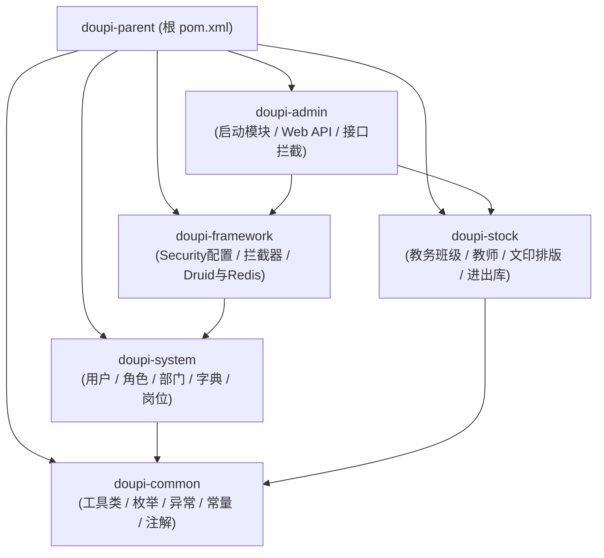

# 04 - 后端服务开发手册 (doupi-server)

## 1. 技术栈与运行环境

- **运行平台**：Java 17 (OpenJDK 17 LTS)
- **核心框架**：Spring Boot 3.x / 4.x
- **持久层框架**：MyBatis 3.5 + Druid 1.2 连接池
- **缓存与会话**：Redis 7.0 + Redisson
- **安全与权限**：Spring Security + JWT Token
- **定时调度**：Quartz 2.3
- **编译工具**：Apache Maven 3.9+

---

## 2. Maven 多模块划分与依赖结构



### 模块详细职责说明
1. **`doupi-admin`**：打包主入口。包含各种 RESTful Controller、Swagger 文档配置、启动类 `DoupiApplication`。
2. **`doupi-framework`**：框架基础设施。包含 JWT 鉴权过滤器、Shiro/Security 安全适配、Druid 监控配置。
3. **`doupi-system`**：若依系统底座。包含用户角色权限 RBAC 逻辑、参数配置、字典管理、登录日志与操作日志。
4. **`doupi-stock`**：学校专属业务引擎。包含班级档案（`edu_class`）、骨干名师（`edu_teacher`）、物资套装（`edu_goods_kit`）、文印试卷审批流（`edu_print_record`）、进出库（`edu_stock_*`）。
5. **`doupi-common`**：全系统底层支持。通用 Result 封装、全局异常处理、安全防 XSS 工具、日期与字符串处理。

---

## 3. Profile 多环境配置规范

后端配置文件位于 `doupi-admin/src/main/resources/`：
- `application.yml`：基础通用配置（Tomcat 线程池、文件上传大小上限 10MB、验证码策略）。
- `application-druid.yml`：数据源连接池与 Druid 监控台配置。

### 3.1 命令行动态传参（生产/测试原生隔离最佳实践）
系统在原生部署启动脚本中，通过 JVM 启动参数直接覆盖环境配置：
```bash
# 生产启动 (8088 端口，连接主库 stuck-mg，Redis 库 0)
java -jar doupi-admin.jar \
  --server.port=8088 \
  --spring.datasource.druid.master.url="jdbc:mysql://127.0.0.1:3306/stuck-mg?..." \
  --spring.data.redis.database=0 \
  --doupi.profile=/data/doupi/uploadPath

# 测试启动 (8089 端口，连接测试库 stuck-mg-test，Redis 库 1)
java -jar doupi-admin.jar \
  --server.port=8089 \
  --spring.datasource.druid.master.url="jdbc:mysql://127.0.0.1:3306/stuck-mg-test?..." \
  --spring.data.redis.database=1 \
  --doupi.profile=/data/doupi-test/uploadPath
```

---

## 4. 后端开发编码与安全规范

1. **统一响应结构**：必须使用 `AjaxResult.success(...)` 或 `TableDataInfo` 分页结构返回，严禁直接返回原生对象。
2. **字符集保护**：涉及字符关联（如 `receiver = nick_name`）时，XML Mapper 中若涉及原生字段比较，统一在关联条件加上 `COLLATE utf8mb4_unicode_ci` 双重保险。
3. **事务控制**：涉及单据（进出库单、文印单、库存增减）的增删改方法，必须显式标注 `@Transactional(rollbackFor = Exception.class)`。
4. **防硬编码规约**：绝对禁止在 Java 代码中硬编码生产服务器公网 IP、云存储密钥或固定端口。
