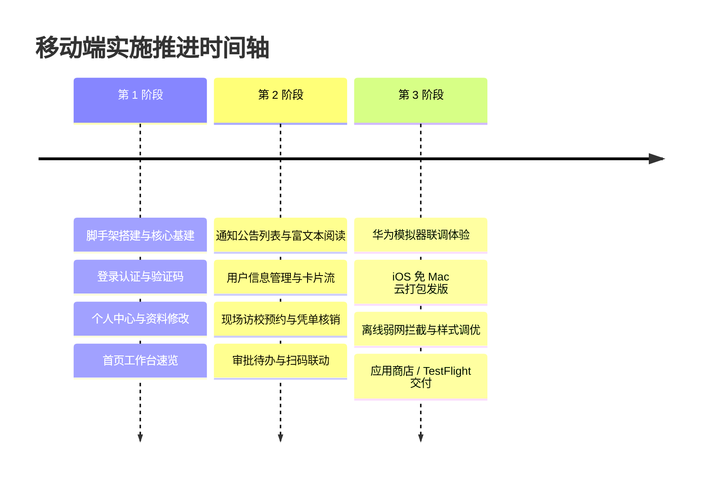

# 豆皮移动端 (Doupi-App - uni-app x 新一代原生版)

> 基于 **uni-app x** + **UTS (uni type script)** + **uvue 原生渲染** 打造的高性能全端移动应用。  
> 彻底摆脱传统 Webview 渲染瓶颈，编译后在 Android 上直达 Kotlin 原生 View、在 iOS 上直达 Swift 原生 View、在鸿蒙 HarmonyOS NEXT 上直达 ArkUI 原生渲染！  
> 性能媲美纯原生，拥有零卡顿、毫秒级启动、120fps 满帧滚动的极致体验。

---

## 目录
- [一、三大核心问题深度解答](#一三大核心问题深度解答)
  - [1. 没有 iOS 和鸿蒙设备，在 Windows 上怎么搞定？](#1-没有-ios-和鸿蒙设备在-windows-上怎么搞定)
  - [2. App 是否把所有 Web 功能全搬上去？](#2-app-是否把所有-web-功能全搬上去)
  - [3. 跨平台技术方案选型（为什么是 uni-app）](#3-跨平台技术方案选型为什么是-uni-app)
- [二、项目结构说明](#二项目结构说明)
- [三、开发环境与快速上手](#三开发环境与快速上手)
- [四、无设备实战操作手册](#四无设备实战操作手册)
  - [iOS 端：免 Mac 云打包与调试流程](#ios-端免-mac-云打包与调试流程)
  - [鸿蒙端：DevEco Studio 官方模拟器配置](#鸿蒙端deveco-studio-官方模拟器配置)
- [五、后端接口联调与配置](#五后端接口联调与配置)
- [六、功能迭代与发版规划](#六功能迭代与发版规划)

---

## 一、三大核心问题深度解答

### 1. 没有 iOS 和鸿蒙设备，在 Windows 上怎么搞定？

很多开发者误以为“开发 iOS 必须买 Mac，开发鸿蒙必须买华为纯血鸿蒙手机”。在 2026 年的现代工具链下，**完全可以在 Windows 纯 PC 环境下搞定三端开发**：

```
                ┌───────────────────────────────────────┐
                │       Windows 电脑 (HBuilderX)         │
                │        编写一套 Vue / uni-app 代码     │
                └──────────────────┬────────────────────┘
                                   │
      ┌────────────────────────────┼────────────────────────────┐
      ▼                            ▼                            ▼
【Android 平台】              【iOS 平台】                【HarmonyOS NEXT 平台】
• 本地 USB 连接安卓手机       • 免 Mac：DCloud 官方云打包     • 免真机：华为官方 DevEco Studio
• 或 Android Studio 模拟器   • Windows 下用 Appuploader 生成证书 • Windows x86_64 本地模拟器
• 承担 90% 日常业务与逻辑调试  • 云真机 (BrowserStack) 验收    • 编译导出 ArkTS 原生工程
```

- **日常开发原则（黄金法则）**：
  - **90% 的页面与业务逻辑**：在 Windows 的 **Chrome 浏览器 (H5 模式)** 或 **Android 真机/模拟器** 上进行秒级热重载调试。
  - **iOS 验证**：业务写完后，在 HBuilderX 中点击“发行 -> 原生 App 云打包”，选择 iOS，由官方服务器编译生成 `.ipa`，配合 TestFlight 或云真机测试。
  - **鸿蒙验证**：在 Windows 上安装华为官方 **DevEco Studio**，利用内置的 x86_64 鸿蒙模拟器直接调试，无需任何真机。

---

### 2. App 是否把所有 Web 功能全搬上去？

> **结论：绝对不应该把所有功能全放上去。必须“端权分离、场景聚焦”。**

#### 为什么不能全放？
1. **屏幕与交互限制**：Web 端动辄有 15 列的表格、复杂的树形菜单权限配置、大段富文本排版、多 Tab 切换，强行塞入 6 寸手机屏幕会导致严重的信息过载和糟糕的用户体验。
2. **使用场景不同**：
   - **PC Web 端**：适合**沉浸式办公、大批量数据录入、系统参数运维、导出海量 Excel、代码生成**。
   - **移动 App 端**：适合**移动中碎片化处理、现场扫码核销、审批流程流转、突发告警通知、个人考勤资料查看**。
3. **安全性考量**：移动端设备容易丢失或处于不安全公共 Wi-Fi，系统超级管理员的敏感配置（如数据库监控、Redis 清除、数据源管理）不应开放至移动端。

#### 建议功能划分清单：

| 功能类型 | 功能模块 | 归属平台 | 理由与说明 |
|:---|:---|:---:|:---|
| **基础必备** | 登录认证、个人中心、修改密码、头像上传 | **两端共有** | 移动端增加生物识别（指纹/面容）、记住密码 |
| **协同提醒** | 通知公告、系统消息、待办事项、审批流转 | **移动端核心** | 随时随地接收推送，利用碎片时间审批 |
| **现场业务** | 访校预约核销、二维码扫描、物资领用出库 | **移动端核心** | 手机硬件特有优势（相机扫码、GPS定位、蓝牙打卡） |
| **数据速览** | 今日运营简报、待办统计卡片、用户只读列表 | **移动端精简** | 卡片流列表，单手滑动即可浏览 |
| **运维开发** | 代码生成器、Quartz 定时任务、数据源配置 | **仅保留 Web** | 纯开发者工具，移动端无实际操作场景 |
| **底层管理** | 菜单权限树配置、字典类型配置、系统参数 | **仅保留 Web** | 树形连线与复杂 JSON 配置，移动端体验极差 |
| **系统监控** | 服务器性能监控、Druid 监控、Redis 缓存键 | **仅保留 Web** | 图表繁多且需大屏排查，更适合 PC 运维 |

---

### 3. 跨平台技术方案选型（为什么是 uni-app）

| 比较维度 | uni-app (本项目选型) | Flutter | React Native | 原生三套独立写 |
|:---|:---:|:---:|:---:|:---:|
| **鸿蒙 NEXT 适配** | 官方原生适配（编译为 ArkTS） | 社区分支探索阶段 | 较弱 | 需单独学 ArkTS+ArkUI |
| **无 Mac 打包 iOS** | ✅ **HBuilderX 自带云打包** | ❌ 需自建 Mac CI/CD | ❌ 需自建 Mac CI/CD | ❌ 必须购买 Mac 电脑 |
| **技术栈一致性** | Vue 体系，学习曲线平缓 | Dart 全新语言 | React / TS | Java + Swift + ArkTS |
| **Doupi 生态契合度** | 极高（海量豆皮移动端模板） | 极低（需完全从零造轮子） | 较低 | 极低 |
| **开发与维护成本** | **1 人即可维护全端** | 需 1-2 人 | 需 1-2 人 | 需 3-4 人全套班子 |

---

## 二、项目结构说明

```text
doupi-app/
├── api/                            # 业务接口统一封装
│   ├── login.js                    # 登录、验证码、用户信息、退出接口
│   ├── system/
│   │   ├── user.js                 # 用户列表/详情/个人资料/头像修改
│   │   ├── notice.js               # 通知公告查询
│   │   └── dict.js                 # 数据字典查询
│   └── monitor/
│       └── operlog.js              # 操作日志查看
├── components/                     # 公共通用组件库
│   ├── rb-card/                    # 白色质感信息卡片组件
│   └── rb-empty/                   # 缺省空状态组件
├── config/
│   └── index.js                    # 核心配置（API基地址、Token请求头、App名称）
├── pages/                          # 视图页面
│   ├── login/login.vue             # 沉浸式登录页（验证码、记住密码）
│   ├── index/index.vue             # 首页（工作台卡片、常用入口、统计简报）
│   ├── work/                       # 业务功能区
│   │   ├── index.vue               # 工作台功能聚合大厅
│   │   ├── notice/                 # 通知公告模块（列表+富文本详情）
│   │   └── user/                   # 用户管理模块（列表卡片+详情展示）
│   ├── message/index.vue           # 消息中心（通知、待办卡片）
│   └── mine/                       # 个人中心
│       ├── index.vue               # 个人资料总览、设置、退出登录
│       ├── info.vue                # 编辑个人昵称、手机、邮箱
│       └── password.vue            # 安全修改密码
├── static/                         # 本地静态图片与 TabBar 图标
│   ├── tabbar/                     # 首页、工作、消息、我的四态高低亮图标
│   ├── logo.png                    # 系统 Logo
│   └── banner.png                  # 工作台首屏 Banner
├── store/                          # Vuex 全局状态管理
│   ├── index.js                    # 状态树根
│   ├── getters.js                  # 快捷计算属性（token, roles, permissions 等）
│   └── modules/user.js             # 用户令牌状态与权限 Action
├── utils/                          # 工具函数库
│   ├── auth.js                     # 本地持久化 Token 管理
│   ├── request.js                  # uni.request 封装（统一拦截、401重定向、Header注入）
│   ├── permission.js               # 细粒度按钮级与角色级权限校验
│   └── common.js                   # 日期格式化、Toast、URL传参辅助
├── App.vue                         # 应用入口根组件（挂载鉴权拦截）
├── main.js                         # JS 入口，注册 Vuex 与 uView UI
├── manifest.json                   # 应用核心配置（AppID、全屏配置、权限策略）
├── pages.json                      # 页面路由与原生 TabBar 底部导航配置
└── uni.scss                        # 全局 SCSS 样式变量与 uView 主题
```

---

## 三、开发环境与快速上手

### 1. 软件准备
- **Node.js**：v16 及以上（当前环境已装好 Node v24）
- **HBuilderX**：官方开发工具，前往 [DCloud 官网](https://www.dcloud.io/hbuilderx.html) 下载“App 开发版”免安装绿色包。

### 2. 本地依赖安装
已在项目目录内置好了 `package.json`，在 `doupi-app` 目录下已执行：
```bash
npm install
```
*(已成功安装 `uview-ui@^2.0.38`)*

### 3. 打开与运行项目
1. 启动 **HBuilderX**，点击菜单栏：`文件 -> 导入 -> 从本地目录导入`，选择 `doupi-app` 文件夹。
2. **H5 网页调试**：
   - 顶部菜单：`运行 -> 运行到浏览器 -> Chrome`。
   - 浏览器打开后按 `F12` 切换为手机设备视口（如 iPhone 14 Pro）。
3. **Android 真机调试**：
   - 准备任一安卓手机，开启“开发者选项”及“USB 调试”，用数据线连接电脑。
   - 顶部菜单：`运行 -> 运行到手机或模拟器 -> 运行到 Android App 基座`。

---

## 四、无设备实战操作手册

### iOS 端：免 Mac 云打包与调试流程

由于你没有 Mac 电脑和 iPhone，请按照以下标准“免 Mac 工作流”操作：

#### 步骤一：证书与描述文件准备（Windows 下即可完成）
1. 注册拥有一个 **Apple Developer** 开发者账号（年费 99 美元）。
2. 在 Windows 电脑上下载安装 **Appuploader** 工具（或使用网页版香蕉云编）：
   - 在该工具内登录你的 Apple ID。
   - 软件会自动在云端与 Apple 后台交互生成 `.p12` 证书文件和 `.mobileprovision` 描述文件并下载到本地，全程无需 Mac 钥匙串。

#### 步骤二：HBuilderX 云打包生成 IPA
1. 在 HBuilderX 中打开 `manifest.json`：
   - 切换到 **“App 图标配置”**，自动生成各尺寸图标。
   - 切换到 **“App 模块配置”**，仅勾选必要模块。
2. 点击顶部菜单：`发行 -> 原生 App-云打包`：
   - 勾选 **iOS (ipa包)**。
   - 证书来源选择：使用自有证书。
   - 导入上一步生成的 `.p12` 和 `.mobileprovision`，输入证书私钥密码。
   - 点击 **“打包”**。
3. DCloud 云端服务器会自动排队并编译出标准的 iOS 安装包 `.ipa`，下载到本地。

#### 步骤三：无 iPhone 怎么做功能测试？
- **方案 A（首选云真机）**：使用 [BrowserStack App Live](https://www.browserstack.com/) 或 [Appetize.io](https://appetize.io/)，在网页上直接上传 `.ipa` 包，浏览器窗口中即可实时操控真实的 iPhone 15/16 进行点击测试。
- **方案 B（TestFlight 分发）**：使用 Appuploader 工具将 `.ipa` 上传至 App Store Connect，通过苹果官方 TestFlight 邀请亲友的 iPhone 协助安装体验。
- **方案 C（低成本真机）**：在二手平台（转转/闲鱼）花 500-800 元购置一台二手的 iPhone SE2 或 iPhone 11 作为专用调试机。

---

### 鸿蒙端：DevEco Studio 官方模拟器配置

由于你没有鸿蒙 NEXT 手机，直接使用华为官方 Windows 模拟器：

#### 步骤一：安装与系统环境准备
1. 访问 [华为开发者联盟官网](https://developer.huawei.com/)，下载安装 **DevEco Studio**（最新稳定版）。
2. 确保 Windows PC 满足：
   - 物理机内存 $\ge$ 16GB（模拟器启动约占用 4~6GB）。
   - 主板 BIOS 已开启 CPU 虚拟化（VT-x / AMD-V）。
   - Windows “启用或关闭 Windows 功能” 中勾选 **Hyper-V**。

#### 步骤二：创建并启动本地模拟器
1. 打开 DevEco Studio，在欢迎界面或顶部菜单点击 `Tools -> Device Manager`。
2. 切换到 `Local Emulator` 页签，点击 `Install` 下载 x86_64 系统镜像。
3. 点击 `New Emulator`，选择 Phone 设备型号，一路默认完成创建。
4. 点击绿色 ▶️ 按钮即可在 Windows 桌面上启动一台如同真机的 HarmonyOS NEXT 虚拟机。

#### 步骤三：uni-app 代码运行至鸿蒙
1. 在 HBuilderX 中，点击菜单 `发行 -> 自定义发行 -> 鸿蒙 (HarmonyOS NEXT)`。
2. 将构建生成的目录导入 DevEco Studio，直接点击 Run 运行到模拟器上。

---

## 五、后端接口联调与配置

### 1. 修改 API 目标地址
打开 `config/index.js`：
```javascript
export default {
  appName: '豆皮/豆皮移动端',
  
  // 联调时根据运行平台调整：
  // • 本地浏览器 H5 运行：使用 'http://localhost:8080'
  // • Android 官方模拟器：使用 'http://10.0.2.2:8080' (该IP专指宿主电脑)
  // • 手机真机调试：请将电脑和手机连在同一局域网 Wi-Fi，改为电脑 IP，如 'http://192.168.1.108:8080'
  baseUrl: 'http://localhost:8080'
}
```

### 2. 鉴权与 Token 续签说明
- 登录成功后，后端返回 JWT Token，系统通过 `utils/auth.js` 自动持久化至本地存储。
- 每次网络请求在 `utils/request.js` 拦截器中自动附加 `Authorization: Bearer <token>`。
- 当 Token 过期或者后端返回 HTTP 401 状态码时，拦截器将自动清空本地会话，并调用 `uni.reLaunch` 无感跳回登录页面。

---

## 六、功能迭代与发版规划



---
*本项目已由 Antigravity 自动化脚手架完成初始化，欢迎导入 HBuilderX 开启体验！*
